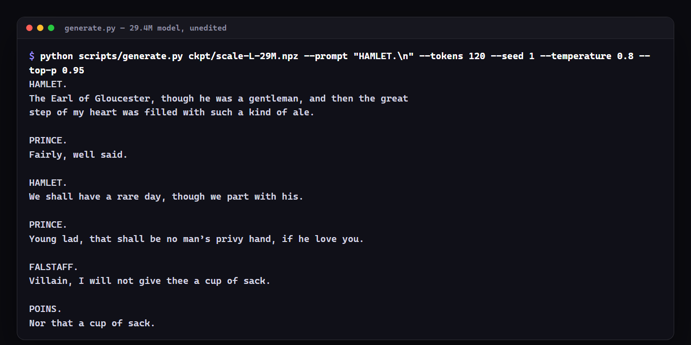
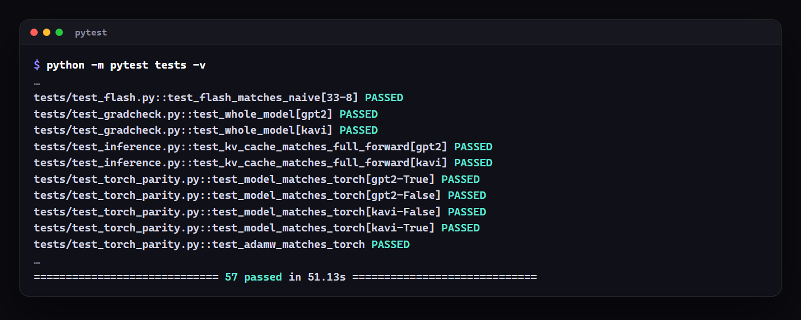
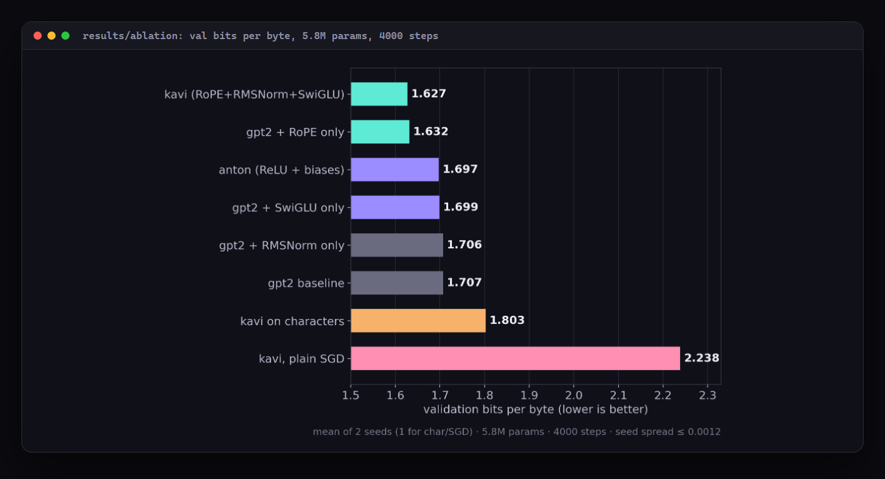
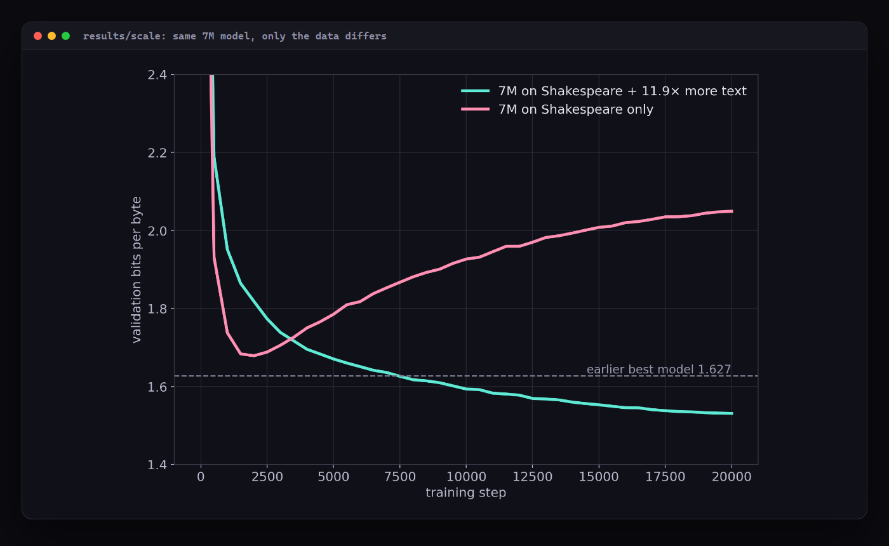
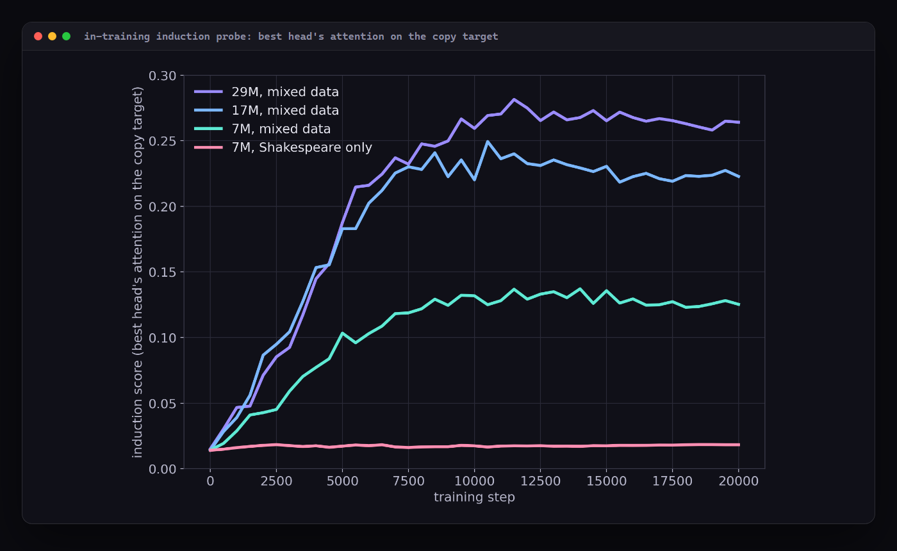
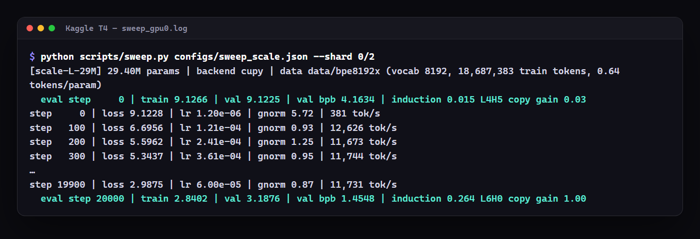
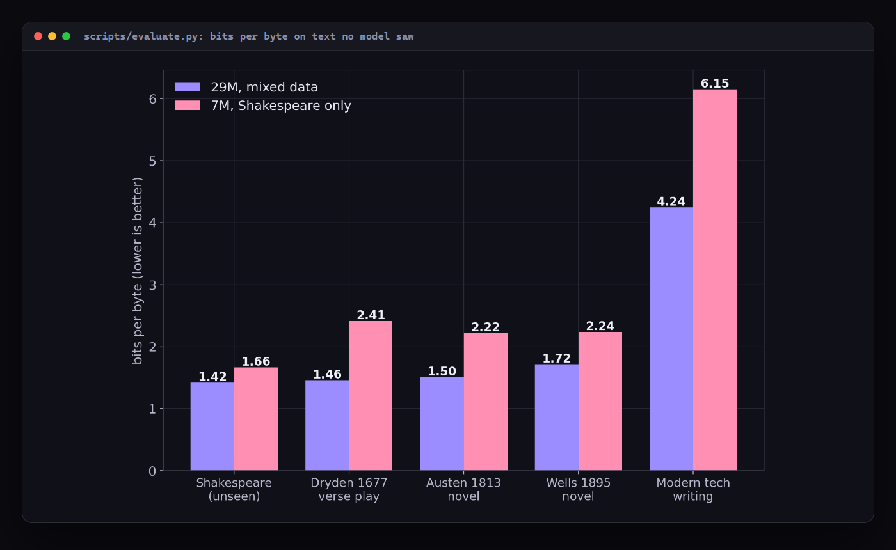

# Kavi — a GPT from absolute scratch, in NumPy

*Kavi* (कवि) is Sanskrit/Hindi for "poet". It is a GPT language model written from scratch
in **pure NumPy**: every layer's forward pass **and backward pass** is derived by hand
and written out, with no autograd, PyTorch or TensorFlow inside the model. It learns to write like
Shakespeare, and the same hand-written code trains on a free Kaggle GPU through CuPy.



Inspired by Green Code's *Anton* series (a GPT in NumPy, trained on Shakespeare). Kavi
follows the same path and sets out to be **better and more rigorous**:

| | Anton | Kavi |
|---|---|---|
| Gradients | "I double-checked my gradient code" | Every brick and the whole model are **proven** two ways: finite-difference gradcheck (float64) **and** parity with PyTorch autograd (to 1e-7) |
| Architecture | GPT-2 style (learned positions, LayerNorm, ReLU) | Switchable: GPT-2 baseline **vs** a Llama-style block with **RoPE + RMSNorm + SwiGLU**, all backward passes hand-derived |
| Evaluation | eyeballing samples; no validation set | held-out split, **bits per byte** (comparable across tokenizers), multi-seed **ablation table** |
| Hardware | 11 h on a CPU; rewrites in PyTorch for GPUs | the **same NumPy code** runs on a free Kaggle GPU (CuPy); CPU/GPU gradients agree to 1e-15 |
| Generation | recomputes the whole context for every token | **KV cache** (7.2× faster), temperature / top-k / top-p |
| Attention | (FlashAttention planned for a later PyTorch episode) | **FlashAttention forward + backward in NumPy**, proven equal to naive attention |
| Data | 1 corpus, ~6M params on ~0.3M tokens | all of Shakespeare (5.4 MB, ~5× "Tiny Shakespeare"), byte-level BPE trained from scratch |
| Docs | videos | a 15-chapter [book](docs/00-overview.md) deriving every formula, plus a [lab journal](docs/journal.md) |

Every gradient is tested, not trusted (`python -m pytest tests`, real run):



## Results

14 runs, two seeds per config, ~5.8M params each (Anton v1's size), 4000 steps on all of
Shakespeare, trained in 160 min on Kaggle's free 2× T4. Lower is better:

| config | val bits/byte | |
|---|---|---|
| **kavi** (RoPE + RMSNorm + SwiGLU) | **1.627** | −0.080 vs gpt2 |
| gpt2 + RoPE only | 1.632 | RoPE alone is ~94% of the gain |
| anton (GPT-2 + ReLU + biases) | 1.697 | |
| gpt2 + SwiGLU only | 1.699 | |
| gpt2 + ReLU only *(follow-up)* | 1.699 | why anton wins: ReLU ties SwiGLU |
| gpt2 + biases only *(follow-up)* | 1.704 | biases: −0.002 |
| gpt2 + RMSNorm only | 1.707 | ties LayerNorm |
| gpt2 (baseline) | 1.707 | |
| kavi on characters | 1.803 | |
| kavi, SGD + momentum 0.9 *(follow-up)* | 1.722 | momentum closes 84% of the gap |
| kavi with plain SGD | 2.238 | Anton's SGD failure, measured |

Seed-to-seed spread is ≤ 0.0012 bpb, so every gap above except RMSNorm's is real. The
follow-up rows come from a second 6-run sweep (59 min); see the [journal](docs/journal.md).



### Scaling up: more data, bigger models

Then three sizes trained for 20,000 steps on Shakespeare **plus an 11.9× corpus** of
early-modern English (Marlowe, Jonson, Milton, the KJV…), with a leakage guard so none of the
validation text sneaks in. Validation is still Shakespeare, so the numbers compare directly:

| model | val bits/byte | induction heads? |
|---|---|---|
| **kavi 29M** | **1.455** | yes: best head 0.26 on the copy target, copying saves 1.0 nat |
| kavi 17M | 1.469 | yes (0.22) |
| kavi 7M | 1.531 | yes (0.13) |
| kavi 7M, Shakespeare only (control) | 1.679, then memorises | **no** (0.02, the uniform level) |

Same model, same steps: the extra text alone is worth 0.148 bpb **and** grows induction heads
that Shakespeare alone never does. 5.9 h on Kaggle's free 2× T4; see
[chapter 14](docs/14-scaling.md#7-results).





The 29M run's real log from the Kaggle T4:



```
HORATIO.
[_Aside._] Though I call thee this, boy, I had rather have beat thee.

HAMLET.
I am going to my lord.
```

Curves, samples, attention maps and the induction-head hunt (none at 5.8M on Shakespeare alone,
clear ones at scale) are in [docs/journal.md](docs/journal.md).

### Testing it properly

`scripts/evaluate.py` runs one battery on any checkpoint (results in `results/eval/`, write-up in
the [journal](docs/journal.md#2026-10-09--testing-the-models-properly)): held-out text from
outside the corpus, memorisation and copy checks, calibration, loss by position, and the
induction circuit.



- **Generalisation follows the data.** The same 7M model scores 2.41 bpb on Dryden's *All for
  Love* (1677) trained on Shakespeare alone, and 1.51 with the extra text. The 17M model beats
  the 29M on every held-out text, while the 29M wins on Shakespeare.
- **It doesn't recite.** Greedy continuation of training passages matches the real text for
  1.6 characters on average (unseen passages: 1.4), and none of the 29M model's sampled 8-word
  runs occurs in the training text.
- **Both halves of the induction circuit.** The previous-token head always sits below the
  induction head (29M: L2H6 → L6H0). The Shakespeare-only models have the first half and not
  the second.

## Quickstart

```bash
pip install numpy matplotlib pytest          # torch optional: only for the parity tests
python -m pytest tests -q                    # 57 tests: gradchecks, parity, equivalences, evaluation

python scripts/prepare_data.py               # download Shakespeare, 90/10 split
python scripts/tokenize_data.py char         # -> data/char
python scripts/tokenize_data.py bpe --vocab 4096   # -> data/bpe4096 (trains BPE, ~10 s)

python scripts/train.py configs/char_kavi.json     # small CPU run
python scripts/generate.py runs/char_kavi/best.npz --prompt "ROMEO:" --tokens 300
python scripts/attention_viz.py runs/char_kavi/best.npz --out docs/img/attention.png
```

GPU (free Kaggle), see [docs/11-gpu.md](docs/11-gpu.md):
```bash
python kaggle/build_kernel.py build --sweep configs/sweep_ablation.json
python kaggle/build_kernel.py push      # then: status / output
```

## Layout

```
kavi/            the library
  backend.py       numpy <-> cupy switch
  module.py        Module/Param: forward caches, backward accumulates
  layers.py        Linear, Embedding, LayerNorm, RMSNorm, ReLU, GELU, Dropout, MLP, SwiGLU
  attention.py     causal multi-head attention, RoPE, KV cache
  flash.py         FlashAttention forward/backward (online softmax + recomputation)
  loss.py          fused softmax cross-entropy
  model.py         GPT (gpt2 / kavi presets), generation, sampling
  optim.py         SGD, AdamW, warmup+cosine, gradient clipping
  gradcheck.py     finite-difference gradient checker
  tokenizers/      char-level and byte-level BPE
  data.py          token datasets, batching, bits-per-byte
scripts/         prepare_data, tokenize_data, train, sweep, summarize, generate, attention_viz,
                 induction, backend_parity
configs/         run configs and sweeps (each ablation is a single-knob diff)
tests/           gradcheck, torch parity, flash, KV cache, BPE, overfit-one-batch
kaggle/          repo -> single-file Kaggle kernel bundler, push/status/output
docs/            the book + journal
```

## The book

0. [Overview](docs/00-overview.md) · 1. [Tokenization](docs/01-tokenization.md) ·
2. [Embeddings](docs/02-embeddings.md) · 3. [Linear layers & backprop](docs/03-linear-and-backprop.md) ·
4. [Normalization](docs/04-normalization.md) · 5. [Attention & RoPE](docs/05-attention.md) ·
6. [MLP: GELU & SwiGLU](docs/06-mlp.md) · 7. [Loss](docs/07-loss.md) ·
8. [Optimizers](docs/08-optimizers.md) · 9. [Training](docs/09-training.md) ·
10. [Sampling & KV cache](docs/10-sampling.md) · 11. [GPU & Kaggle](docs/11-gpu.md) ·
12. [FlashAttention](docs/12-flash-attention.md) · 13. [Interpretability](docs/13-interpretability.md) ·
14. [Scaling up](docs/14-scaling.md) ·
[Journal](docs/journal.md)

## License

MIT, see [LICENSE](LICENSE).
