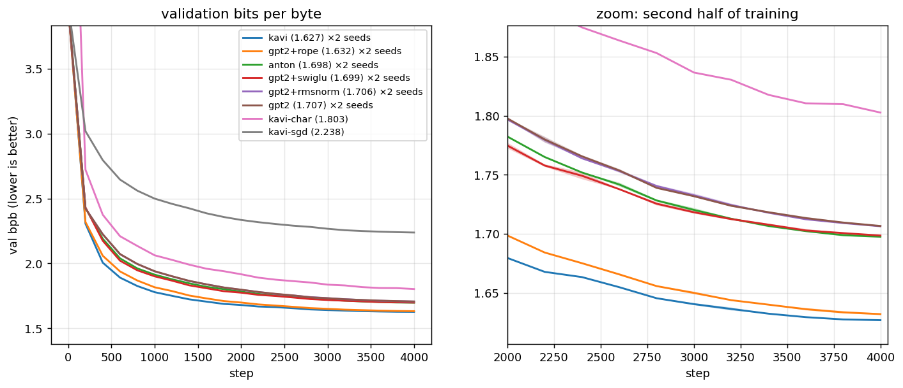
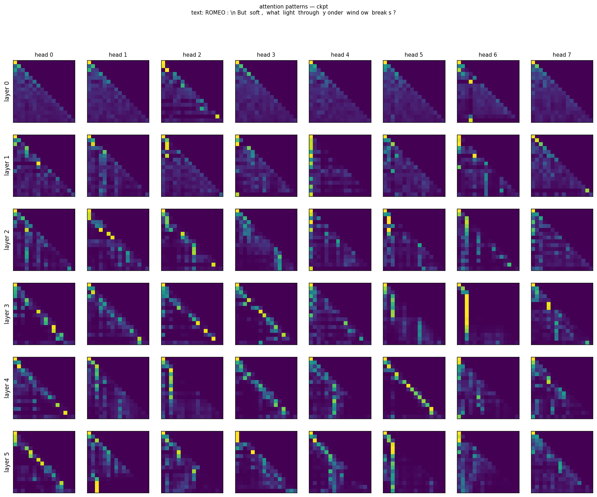
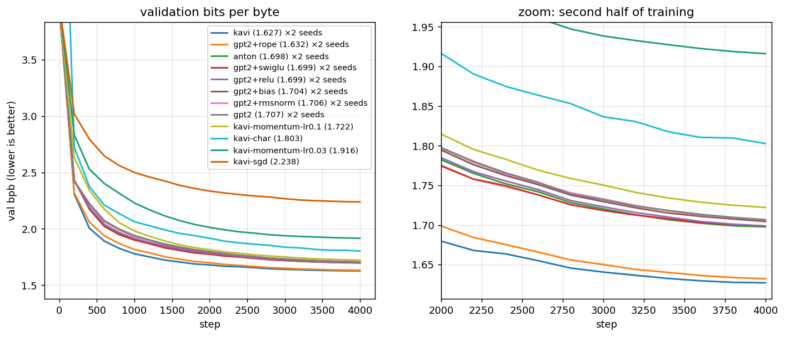
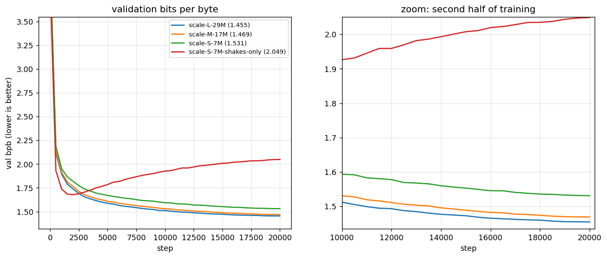
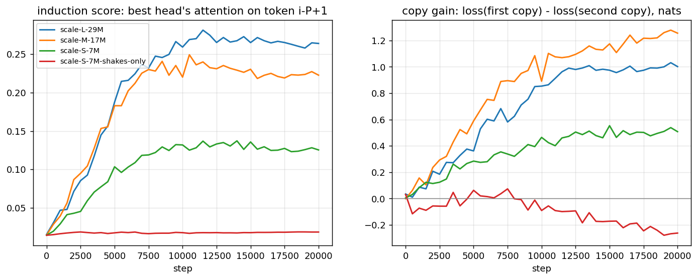

# Lab journal

What we actually ran, what came out, and what we think it means. Chapters 00–13 explain how
the machine works; this page records what it did. Every number here comes from a file in
[`results/`](../results/), and every table can be regenerated with
`python scripts/summarize.py results/<name> --plot docs/img/<name>.png`.

---

## 2026-10-07 · Day 1: does it train at all? (CPU)

**Setup.** `configs/char_kavi.json`: 0.80M params, char vocabulary (100), T=128,
4 layers × 4 heads × 128 wide, on the laptop CPU in NumPy.

**Result.** The run was killed for lack of RAM around step 1075, after the best checkpoint at step 1000
had been saved. Val loss fell 4.58 → 1.597 nats per character
(**6.53 → 2.275 bpb**). The step-0 loss of 4.59 matches $\ln 100 = 4.605$, so the model starts
as a uniform guesser, as [chapter 07](07-loss.md) predicts. Throughput was only 1.4–3.8k tokens/s,
because the machine had about 2 GB of free RAM and was busy with other work. That was enough to see it learn,
and too slow for real experiments. This run is the source of the loss curve in
[chapter 09](09-training.md).

## 2026-10-07 · Day 1: the GPU probe (Kaggle, 4 minutes)

Before spending GPU hours we pushed a tiny sweep (`configs/sweep_probe.json`: gpt2 vs kavi,
300 steps each) to check three things:

| question | answer |
|---|---|
| Does our NumPy code run unmodified on CuPy? | Yes. Kaggle assigned **2× Tesla T4**, and CuPy 14.0.1 was preinstalled |
| Are CPU and GPU gradients the same? | `backend_parity.py` in float64: losses identical to 12 digits, worst gradient difference **7.6e-16** |
| How fast? | **32–33k tokens/s per T4**, about 10–20× the laptop |

After 300 steps, kavi was already ahead: **2.156 vs 2.335 val bpb**
([`results/probe/`](../results/probe/)). The kernel was then changed to run one sweep shard
per GPU in parallel ([chapter 11](11-gpu.md)).

## 2026-10-07/08 · The ablation sweep

**Question.** Anton's model was a GPT-2-style block. Kavi's default is a Llama-style block. Which
of the three changes (RoPE, RMSNorm, SwiGLU) actually helps, by how much, and is the
difference bigger than seed noise?

**Setup** (`configs/bpe_base.json` + `configs/sweep_ablation.json`):

- data: all of Shakespeare, byte-level BPE with 4096 tokens, 1.58M train tokens and 179k val tokens;
- model: C=256, 6 layers, 8 heads, T=256, dropout 0.2, no biases, about **5.8M params** for
  every config (SwiGLU's hidden width is set to 8C/3 so the parameter count matches, see
  [chapter 06](06-mlp.md));
- training: AdamW (β=0.9/0.95, wd 0.1), lr 1e-3 with 200 warmup steps and cosine decay to 1e-4, clip 1.0,
  batch 32 × 256 = 8192 tokens, **4000 steps = 32.8M tokens ≈ 21 epochs**;
- every config differs from `gpt2` by **one knob**, and the six main configs run with 2 seeds each;
- hardware: 14 runs on two T4s in **160 min** (18–23 min per run). Free tier.

### Results

| config | what changed vs `gpt2` | val bpb (mean of 2 seeds) | seed spread | Δ vs gpt2 |
|---|---|---|---|---|
| **kavi** | RoPE + RMSNorm + SwiGLU | **1.6269** | 0.0004 | **−0.080** |
| gpt2+rope | learned positions → RoPE | 1.6321 | 0.0012 | −0.075 |
| anton | GELU → ReLU, biases on | 1.6974 | 0.0009 | −0.009 |
| gpt2+swiglu | GELU MLP → SwiGLU | 1.6986 | 0.0012 | −0.008 |
| gpt2+rmsnorm | LayerNorm → RMSNorm | 1.7065 | 0.0003 | −0.000 |
| gpt2 | baseline | 1.7067 | 0.0008 | — |
| kavi-char (1 seed) | char vocabulary instead of BPE | 1.8027 | — | — |
| kavi-sgd (1 seed) | AdamW → plain SGD (lr 0.1→0.01, no momentum) | 2.2381 | — | — |



*Left: the whole run. Right: zoom on steps 2000–4000. The shaded bands are the min–max over seeds and are
barely visible because the seeds agree so closely.*

### What we learned

1. **RoPE accounts for nearly all of the gain.** Swapping learned position embeddings for RoPE
   alone gives −0.075 bpb, about 94% of the full kavi improvement. Our reading: RoPE gives every head
   relative position for free, and with only 1.58M training tokens, a learned 256×256 position table is
   a lot to learn from scratch ([chapter 05](05-attention.md)).
2. **The ranking is real, not noise.** The two seeds of a config differ by at most 0.0012 bpb.
   The gaps between gpt2+rope, gpt2+swiglu and gpt2 are 6–60× that.
3. **RMSNorm ties LayerNorm.** We got 1.7065 vs 1.7067, well within seed noise. (Seed 1 of both even
   matched to 4 decimals at step 4000. We checked: the configs differ and the curves differ at
   every earlier step, so this is a coincidence.) RMSNorm's selling point in big models is
   speed and simplicity, not quality, and that's consistent with this result.
4. **SwiGLU and RMSNorm mostly buy faster early progress.** At step 2000, kavi leads
   gpt2+rope by 0.019 bpb; by step 4000 the lead is 0.005. gpt2+swiglu's lead over gpt2
   shrinks from 0.023 to 0.008 over the same stretch. RoPE's lead doesn't shrink.
5. **A surprise: Anton's block beats the GPT-2 block.** `anton` (ReLU + biases) is 0.009
   better than `gpt2` (GELU, no biases). Two knobs changed together, so we can't say which
   one did it. A follow-up should run `gpt2+bias` and `gpt2+relu` separately. One hypothesis is that with
   learned positions, the query and key biases let a head score keys by position in a way
   that doesn't depend on content. (The key bias alone is provably useless, see
   [chapter 05 §8](05-attention.md); the query bias isn't.)
   **Resolved 2026-10-09:** it is the ReLU (−0.008), and the biases add only −0.002. See the
   follow-up sweep below.
6. **SGD fails the way it failed for Anton.** Same model and same budget, with plain SGD
   instead of AdamW: 2.238 vs 1.627 bpb. After 4000 steps it still hasn't reached where AdamW was
   at step 400. The sample below shows what that gap reads like. [Chapter 08](08-optimizers.md)
   explains why. **Update 2026-10-09:** this run had no momentum. With momentum 0.9 at the same
   lr, SGD reaches 1.722, closing 84% of the gap (follow-up sweep below).
7. **BPE beats characters at equal steps.** Kavi on characters reaches 1.803 bpb vs 1.627 on BPE.
   Caveat: at equal steps, a 256-token window covers about 776 bytes of BPE text but only
   256 bytes of characters, so the BPE model also saw about 3× more text. This is a
   comparison at equal compute, not at equal data.
8. **The better model overfits more.** At the end, the val−train gap was 0.60 nats for kavi
   vs 0.42 for gpt2, after about 21 passes over the data. Val loss was still falling at step
   4000 in every run (best checkpoint = last or second-to-last eval), so dropout 0.2 is holding.
   More data, rather than more steps, is the obvious next lever ([chapter 09](09-training.md)).

### Samples

Generated at the end of each run from the best checkpoint's weights (`train.sample_tokens=400`,
temperature 0.8, top-k 50, as `train.py` does). The prompt is a newline. Excerpts are unedited.

**kavi (1.627 bpb).** It holds one scene (Hamlet and Horatio) with consistent speakers and
asides:
```
HORATIO.
O my lord, you are not yet in it.

HORATIO.
This is a very grievous thing to th’ unseen.

HORATIO.
[_Aside._] Though I call thee this, boy, I had rather have beat thee.

HAMLET.
I am going to my lord.
```

**gpt2 (1.707 bpb).** The verse is fluent, but the history-play names pile up without sense:
```
SUFFOLK.
Then were the first prince so, when was his son
Hath got the Duke of Salisbury.

SURREY.
Where’s the Earl of York?
```

**kavi-sgd (2.238 bpb).** The form is still there, but the grammar falls apart:
```
KING.
SECOND LORD.
Why, I had a man, and thy love
And I’er a word, then,
That they will tell me.
Nay, he hath that I see my son?
```

**kavi-char (1.803 bpb).** Character level: well-formed words and plausible names, with loose sense:
```
LADY MACBETH.
As thou art not as long as do make me any.

CLEOPATRA.
What kneel you here?
```

And with the KV cache from a prompt (`python scripts/generate.py ckpt/kavi-s2.npz --prompt
"ROMEO:" --tokens 120 --seed 1`):
```
JULIET.
I am sure I am, and fear not how to love.

ROMEO.
Put on my poor achievement to my soul.
```

## 2026-10-08 · Looking inside the best model

### Attention maps

`python scripts/attention_viz.py ckpt/kavi-s2.npz` on *"ROMEO:\nBut soft, what light through
yonder window breaks?"*:



Things that stand out (see [chapter 13](13-interpretability.md) for how to read the grid):

- **Previous-token heads.** Layer 4 head 5 is an almost perfect line one step below the
  diagonal. Layer 3 heads 2–3 are softer versions of the same thing.
- **One-token "anchor" heads.** Layer 3 head 6 sends almost every query to one early token
  (the newline after `ROMEO:`), and several layer-1 and layer-2 heads put much of their weight
  on the first token. This is the "attention sink" pattern: when a head has nothing useful to
  do, it parks its attention somewhere harmless.
- Layer 0 heads are diffuse, averaging over recent tokens.

### Searching for induction heads: a negative result

An *induction head* implements "the last time I saw the current token, what came next? Predict
that." It's the classic copy circuit behind in-context learning, and it's built from a previous-token head
plus a head that matches on the previous token's output. We wrote
[`scripts/induction.py`](../scripts/induction.py) to look for one. It feeds the model a
50-token sequence followed by the *same* 50 tokens and measures, per head, how much attention
position $i$ pays to position $i-50+1$ (the token after the earlier occurrence).

| model | loss on 1st copy | loss on 2nd copy | strongest induction score | strongest prev-token score |
|---|---|---|---|---|
| kavi-s2 | 3.119 | 2.973 | 3.3% | 42.8% (L4 H5) |
| gpt2-s2 | 3.211 | 3.023 | 7.4% | 37.1% |
| anton-s2 | 3.189 | 2.981 | 8.7% | 41.2% |

*(Real val passages, 8 sequences. Uniform attention would score about 1.3%. With uniformly random token
ids the kavi losses are 14.83 → 14.82, and with tokens drawn at random from the val split 10.23 → 10.11.)*

**No model has an induction head yet.** A model with one would score tens of percent on
the induction target, and its second-copy loss would collapse toward 0. Here the
second copy is only 0.15–0.21 nats easier, which is ordinary context help, not copying. All three
models *do* have strong previous-token heads, the first half of the circuit. In the
literature, induction heads form through a fairly sudden phase change during training, and our
models (5.8M params, 33M tokens) haven't reached it. This is a good experiment to rerun on
longer or bigger training.

*Update, same day:* rerun, and resolved. More diverse data grew induction heads in every model;
Shakespeare alone grew none (see the scale-up section below).

## 2026-10-09 · Follow-up sweep: explaining Anton, and SGD done fairly

Kaggle kernel v3, 2× T4, 59 minutes, 6 runs of the same 4000-step budget as the ablation
(`configs/sweep_followup.json`; logs in `results/followup/`). Two questions were left open on
day 2: *which* of Anton's two changes made it beat GPT-2 (finding 5), and how much of SGD's
failure was the missing momentum (finding 6).



### Anton's edge is ReLU, not the biases

| config | what differs from gpt2 | mean val bpb (2 seeds) | vs gpt2 |
|---|---|---|---|
| gpt2 | none | 1.7067 | 0 |
| gpt2+bias | biases on | 1.7044 | −0.0023 |
| gpt2+relu | GELU → ReLU | **1.6987** | **−0.0080** |
| anton | both | 1.6974 | −0.0093 |
| gpt2+swiglu *(day 2)* | GELU → SwiGLU | 1.6986 | −0.0081 |

1. **ReLU does almost all of it.** It accounts for −0.008 of anton's −0.009. Biases add −0.002.
   The two single-knob effects sum to −0.0103 against −0.0093 measured together. That is roughly
   additive: the 0.001 difference is the size of the seed spread.
2. **The bias effect is small but real-looking.** The seed ranges don't overlap: gpt2+bias is
   1.7041–1.7047 and gpt2 is 1.7063–1.7071. But with two seeds, 0.002 is the kind of number to
   hold loosely. It also undercuts our day-2 hypothesis that query biases would let heads
   score keys by position: if they did, they would be worth more than 0.002.
3. **The real surprise: ReLU ties SwiGLU.** 1.6987 vs 1.6986 at step 4000. They do not get there
   the same way. At step 2000, SwiGLU is ahead (1.775 vs 1.785 mean bpb), and ReLU catches up over
   the second half. So at this scale, **GELU is the odd one out, not ReLU**. The usual story,
   "GELU's smooth gate beats ReLU's hard one", doesn't hold here. ReLU also ends with a smaller
   val−train gap (+0.41 vs +0.49 nats for SwiGLU), so it reaches the same val loss with a
   *higher* train loss. Our guess is that ReLU's exact zeros act as a mild regulariser on 21-epoch
   data, but we haven't tested that.

### Momentum is most of what SGD was missing, but not all

All on the kavi model, 4000 steps; lr is the peak of the same warmup + cosine schedule.

| optimizer | peak lr | val bpb |
|---|---|---|
| plain SGD *(day 2)* | 0.1 | 2.2381 |
| SGD + momentum 0.9 | 0.03 | 1.9162 |
| SGD + momentum 0.9 | **0.1** | **1.7221** |
| AdamW *(day 2)* | 0.001 | 1.6269 |

4. **At the same lr, adding momentum takes SGD from 2.238 to 1.722.** That is −0.516 bpb from one
   knob, and it closes 84% of the gap to AdamW. Momentum averages the gradient over about
   1/(1−0.9) = 10 steps, so the noise of a 32-sequence batch cancels and the consistent
   direction adds up. The effective step at lr 0.1 is lr/(1−β) = 1.0 in plain-SGD terms.
5. **The remaining 0.095 is per-parameter scaling.** SGD uses one learning rate for every
   weight. Adam divides each weight's step by its own recent gradient size
   ([chapter 08 §4](08-optimizers.md)), so the embedding rows of rare tokens, which get small and
   infrequent gradients, still move. The momentum model at step 4000 is still behind AdamW-gpt2
   (1.707), despite having RoPE.
6. **The lr sweep isn't bracketed.** The best lr was the highest one tried, so 0.3 might be
   better still. Both runs were stable: no loss spikes, median gradient norm about 1 before
   clipping. Both were still improving at step 4000, by 0.006 nats over the last 200 steps at
   lr 0.1. This is a fair comparison at *one* budget, not a tuned SGD.

## 2026-10-09 · Scale-up: more data, bigger models, and the induction heads

Kaggle kernel v5, 2× T4, 5.9 hours (`configs/sweep_scale.json`; logs in `results/scale/`; the
full write-up is [chapter 14, section 7](14-scaling.md#7-results)). Three kavi sizes trained
for 20,000 steps on Shakespeare plus an 11.9× early-modern English corpus (BPE 8192). A
control used the small size on Shakespeare alone. Validation is still Shakespeare's val split,
so bpb compares directly with the ablation. One seed each.

| run | params | best val bpb | final val−train gap |
|---|---|---|---|
| **L** | 29.4M | **1.4548** | +0.347 |
| M | 17.3M | 1.4692 | +0.193 |
| S | 6.8M | 1.5311 | +0.013 |
| S, Shakespeare only | 6.8M | 1.6789 (step 2000, then 2.049 by 20k) | +3.634 |



1. **Data was the bottleneck.** The same S model gains 0.148 bpb from the extra text alone. On
   Shakespeare only, it peaks at step 2000 and then memorises (train loss 1.09 nats, val 4.72).
   On the mix it improves at every eval.
2. **Size helps, then stops helping.** S → M is −0.062 and M → L only −0.014. L's growing gap
   says it has started memorising its 8.8 passes, so more text, not more width, is the next
   lever. L ends 0.172 bpb ahead of the ablation's best model.
3. **Induction heads appeared, and data is what grew them.** With the in-training probe
   (`train.induction_probe`), L's best head (L6H0) reaches 0.26–0.28 attention on the copy
   target, and the repeated half of a random sequence becomes 1.0 nat easier. The same S model
   reaches 0.13 on the mix and stays at 0.018, the uniform level, on Shakespeare only. At step
   4000, the ablation's length, S on the mix is already at 0.077 against the ablation kavi's
   0.033. So the negative result of 2026-10-08 was about memorisable data, not too few steps.
   The rise is a steady ramp from step 1000 to about 7000, not a single jump between two evals.



## 2026-10-09 · Testing the models properly

`scripts/evaluate.py` runs one battery on any checkpoint and writes `results/eval/<name>.json`
(tests: `tests/test_evaluate.py`). Five checkpoints, laptop CPU, 10 to 19 minutes each. Every
checkpoint is the run's best-val one, so the Shakespeare-only control is its step-2000 weights.

| | L 29M | M 17M | S 7M | S, Shakespeare only | ablation kavi 5.8M |
|---|---|---|---|---|---|
| val bpb, 256-token chunks | 1.454 | 1.467 | 1.529 | 1.680 | 1.628 |
| val bpb, sliding window (≥128 context) | **1.420** | 1.433 | 1.498 | 1.664 | 1.611 |
| top-1 / top-5 next-token accuracy | 0.408 / 0.615 | 0.402 / 0.609 | 0.381 / 0.588 | 0.321 / 0.525 | 0.355 / 0.568 |
| calibration error (ECE) | 0.038 | 0.028 | 0.012 | 0.066 | 0.054 |
| Dryden, *All for Love* (1677) | 1.459 | **1.449** | 1.505 | 2.414 | 2.242 |
| Austen, *Pride and Prejudice* (1813) | 1.503 | **1.496** | 1.547 | 2.220 | 2.135 |
| Wells, *The Time Machine* (1895) | 1.716 | **1.713** | 1.748 | 2.240 | 2.157 |
| this repo's docs (2026) | 4.244 | **4.105** | 4.253 | 6.151 | 6.579 |
| best induction head / copy gain (nats) | L6H0 0.25 / 0.89 | L6H1 0.22 / 1.09 | L5H5 0.12 / 0.47 | 0.016 / 0.00 | 0.018 / 0.02 |
| best previous-token head | L2H6 0.62 | L5H4 0.61 | L3H4 0.54 | L4H0 0.65 | L3H2 0.54 |

1. **Out-of-distribution text falls off with distance, and data is what moved it.** Dryden's
   verse play is nearly as easy as Shakespeare for the mixed-data models; Victorian prose is
   harder; modern Markdown is foreign to all of them. The same 7M model scores 2.41 on Dryden
   trained on Shakespeare alone and 1.51 with the extra text.
2. **M beats L on every held-out text, while L wins on Shakespeare.** L's val−train gap (+0.35)
   already said it was fitting its training distribution; this is the same thing seen from
   outside. More text, not more width, remains the next lever.
3. **No model recites.** Greedy continuation of 100 training passages matches the real text for
   1.2 to 1.6 characters on average, the same as for unseen passages (1.0 to 1.4), and never
   reaches 50 characters. Of the 8-word runs in 8 samples of 400 tokens, at most 0.7% occur in
   the training text (L: none); real unseen Shakespeare shares 0.2 to 0.3% with it. The control
   memorised later in its run (train loss 1.09 nats at step 20k), but those weights were not
   kept. Every speaker name the mixed models write is a real character.
4. **The induction circuit has both halves where it should.** In every model that has induction
   heads, the strongest previous-token head sits in an earlier layer than the induction head (L:
   L2H6 then L6H0). The two Shakespeare-only models have strong previous-token heads (0.54 to
   0.65) and no induction head at all, so data grew the second half, not the first.
5. **Housekeeping.** The KV cache reproduces the uncached logits on all five checkpoints.
   Loss by position falls from 5.0 nats at position 0 to 3.1 by 128 to 255, and still drops past
   64, so the 256-token context is used. Sliding-window scoring is 0.016 to 0.034 bpb better than
   the training run's chunked number for the same reason. Calibration is good everywhere (ECE
   ≤ 0.066) and gets slightly worse as the models grow.

## Known limitations of these results

- **One budget.** Every run is 4000 steps. A ranking at 4000 steps can change at 40,000
  (point 4 above shows the gaps already moving).
- **Two seeds** for the main configs and one for char and SGD. Enough to show the gaps are
  real, not enough for error bars on small differences.
- **The day-2 SGD run had no momentum.** `optimizer: "sgd"` built plain SGD, but its
  `config.json` recorded `momentum: 0.9`, a setting nothing read. Since 2026-10-09, `train.py`
  writes `momentum: 0.0` for `sgd` and rejects unknown optimizer names. The follow-up's
  `momentum` runs are the fair comparison. They narrowed the gap from 0.611 to 0.095 bpb without
  closing it. Their lr sweep is unbracketed, and no SGD run uses weight decay.
- **`TokenData.batch` never picks the very last token of a split as a target** (an off-by-one in
  the random start, `rng.integers(0, len(data) - block_size - 1)`). We left it unfixed so these
  numbers stay exactly reproducible. It affects one token out of 1.58M.

## What's next

- [x] `gpt2+bias` and `gpt2+relu` single-knob runs, to explain finding 5. ReLU did it (2026-10-09)
- [x] `kavi-momentum` (SGD + momentum 0.9, lr 0.03 / 0.1), the fair version of finding 6: 1.722 (2026-10-09)
- [ ] Bracket the momentum lr (0.3, maybe 1.0); test whether ReLU's smaller val−train gap is regularisation
- [x] A longer run (20k steps) to look for the induction-head phase change: heads at every size on the mixed corpus, none on Shakespeare alone (2026-10-09)
- [x] More data: a bigger public-domain corpus (11.9×, [chapter 14](14-scaling.md)). S gains 0.148 bpb; L reaches 1.455 (2026-10-09)
- [ ] L is data-bound again (gap +0.35): try dropout 0.2, or more text, before more width
- [x] Where are the previous-token heads in the scale-up models? Always a layer or more below the induction head (L: L2H6 → L6H0); the Shakespeare-only models have them but no induction heads (2026-10-09, `scripts/evaluate.py`)
